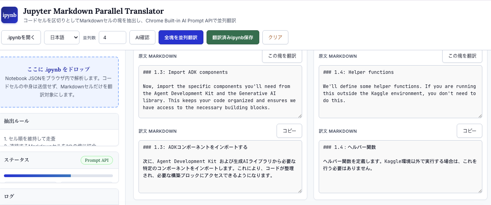

# Jupyter Markdown Parallel Translator

Jupyter Notebook (`.ipynb`) 内の **Markdownセルのみを抽出し、Chrome Built-in AI (Prompt API) を用いて完全ローカルかつ並列に翻訳** するシングルファイルWebアプリケーションです。

学術論文誌をイメージした視認性の高いUIで、Notebookのコードセル構造を維持したまま、対話的に翻訳・編集・エクスポートが可能です。

---

## 🌟 特徴

- 🔒 **完全ローカル処理（プライバシー保護）**:
  - 外部のAI APIサーバーやサードパーティのクラウドへデータを送信しません。
  - Chrome組み込みのオンデバイスAI（Chrome Built-in AI / Prompt API）を使用するため、オフライン環境や機密データを含むNotebookでも安心して利用できます。
- 💻 **コードセル非送信 & 構造保持**:
  - 翻訳対象は **Markdownセルのみ** です。コードセルの内容や実行結果は翻訳モデルへ送信されません。
  - 連続するMarkdownセルを1つの翻訳単位（塊）としてまとめ、コードセルを区切りとして自動分割します。
- ⚡ **並列翻訳**:
  - 設定した並列数（デフォルト 4並列）で複数のMarkdown塊を同時に処理し、高速に翻訳します。
- 📝 **Markdown構造・記法の維持**:
  - 見出し、箇条書き、表、リンク、数式（LaTeX）、インラインコード、コードブロックの記法を崩さずに翻訳します。
- 🎨 **Academic Journal UI**:
  - 白背景とロイヤルブルーを基調とした明るく視認性の高いデザイン。
  - 原文と訳文を左右（上下）に配置し、手動での調整や編集も直感的に行えます。
- 💾 **元Notebook構造への再結合 & 保存**:
  - 翻訳完了後、元の `.ipynb` のセル順序・構造に翻訳済みテキストを正確に埋め直して `.translated.ipynb` としてダウンロード可能です。

---

## 🛠 仕組み（抽出・再結合ルール）

1. **抽出 (Extract)**:
   Notebookを走査し、連続するMarkdownセルを1つの翻訳 chunk（塊）に統合します。セル境界には `<!-- __MD_CELL_BOUNDARY_N__ -->` のHTMLコメントマーカーを自動挿入します。
2. **並列翻訳 (Parallel Translation)**:
   プロンプト要件を付与し、Chrome Built-in AI (`LanguageModel` / `Prompt API`) へ並列リクエストを発行します。
3. **按分・再結合 (Recombine)**:
   訳文に含まれる境界マーカーを元に各Markdownセルへ正確に切り分け、元のコードセルや非翻訳セルと統合して新しいNotebook JSONを再構築します。

---

## 📋 動作要件

本アプリを利用するには、**Chrome Built-in AI (Prompt API)** が利用可能な環境が必要です。

- **ブラウザ**: Google Chrome（Dev / Canary または バージョン 127 以降の最新安定版）
- **Chrome Flagの設定** (`chrome://flags`):
  - `#optimization-guide-on-device-model`: `Enabled BypassPerfRequirement`
  - `#prompt-api-for-gemini-nano`: `Enabled`
- **コンポーネントのダウンロード** (`chrome://components`):
  - `Optimization Guide On Device Model` が最新状態（Downloaded）になっていることを確認してください。

> 💡 画面上の「**AI確認**」ボタンを押すことで、お使いのブラウザでPrompt API（またはTranslator API）が有効になっているかを自動判定できます。

---

## 🚀 使い方

1. **アプリを開く**:
   `jupyter-markdown-parallel-translator.html` をお好きなWebブラウザ（Chrome）で直接開きます。（サーバー設置は不要です）
2. **Notebookの読み込み**:
   `.ipynb` ファイルを画面左側のドロップエリアにドラッグ＆ドロップするか、「.ipynbを開く」ボタンから選択します。
3. **設定の調整**:
   - **翻訳先言語**: 日本語 / English / 한국어 / 简体中文 / 繁體中文 から選択します。
   - **並列数**: 1〜10（デフォルト 4）で指定します。
4. **翻訳の実行**:
   - 「**AI確認**」をクリックしてBuilt-in AIの利用可否を確認します。
   - 「**全塊を並列翻訳**」をクリックすると、すべてのMarkdownセルが一括で翻訳されます。（個別の塊ごとに「この塊を翻訳」することも可能です）
5. **保存**:
   翻訳結果を確認・編集後、「**翻訳済みipynb保存**」をクリックして新しい `.ipynb` ファイルを保存します。

---

## 📁 ファイル構成

```text
.
├── jupyter-markdown-parallel-translator.html  # アプリ本体（HTML/CSS/JS統合済）
└── README.md                                  # 本ドキュメント
```

---

## 🛡 ライセンス & セキュリティ

- **単一HTMLファイル**: 外部依存ライブラリ（Google Fontsを除く）なしで動作します。
- **プライバシー**: すべてのテキスト処理はブラウザのメモリ内およびローカルAIモデル上で行われ、外部サーバーへの通信は発生しません。

## スクリーンショット


